<p align="center">
  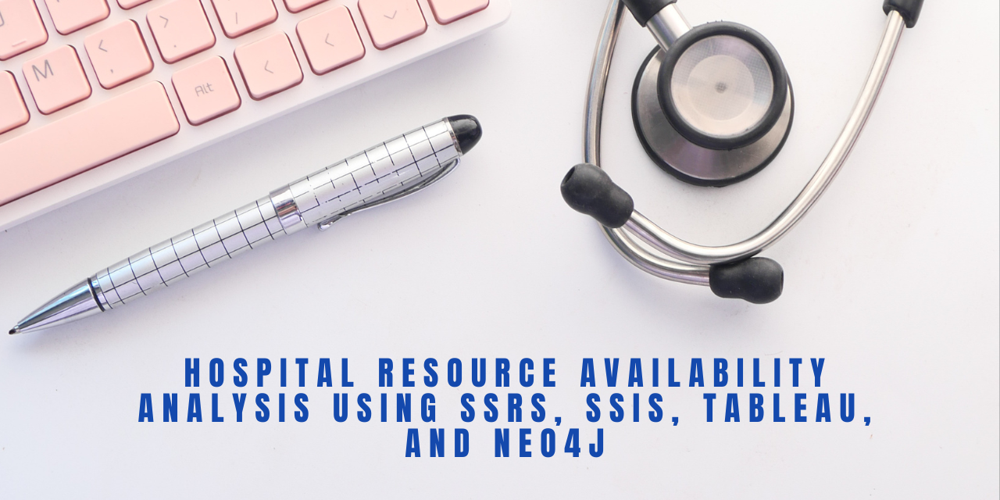
</p>

<p align="center">


</p>

# Hospital Resource Availability Analysis using SSIS, SSRS, Tableau, and Neo4j

## Overview

This project presents an end-to-end Business Intelligence (BI) solution for analyzing hospital resource availability using the New York Statewide Hospital Bed Capacity dataset.

The solution integrates:

* SQL Server Database
* SQL Server Integration Services (SSIS)
* SQL Server Reporting Services (SSRS)
* Tableau
* Neo4j Graph Database

The objective is to analyze hospital bed availability, ICU capacity, occupancy rates, and regional healthcare readiness to support operational planning and decision-making.

---

## Project Objectives

* Design a dimensional data warehouse using a Star Schema.
* Build ETL pipelines using SSIS.
* Generate analytical reports using SSRS.
* Create interactive visualizations using Tableau.
* Model healthcare relationships using Neo4j.
* Compare relational and graph database approaches.
* Support healthcare capacity planning and resource allocation.

---

## Dataset

### Dataset Source

New York Statewide Hospital Bed Capacity Dataset

https://health.data.ny.gov/Health/New-York-State-Statewide-Hospital-Bed-Capacity

The dataset contains:

* Hospital facility information
* Acute Care Bed Capacity
* ICU Bed Capacity
* Occupancy Metrics
* Regional Healthcare Information
* Daily Hospital Resource Availability

---

## System Architecture

<p align="center">
  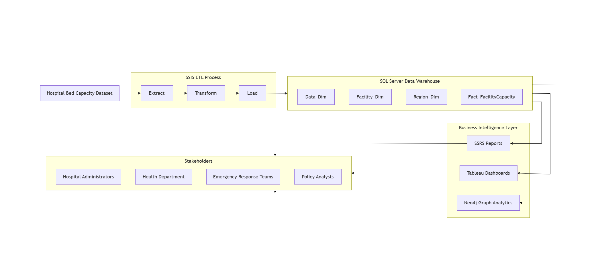
</p>

### Workflow

1. Data Collection
2. Data Extraction
3. Data Transformation
4. Data Warehouse Creation
5. SSIS ETL Processing
6. SSRS Report Generation
7. Tableau Dashboard Development
8. Neo4j Graph Modeling
9. Analytical Insights

---

## Star Schema Design

The dimensional model consists of:

### Fact Table

**Fact_FacilityCapacity**

Stores:

* Acute Care Beds
* Available Beds
* Occupied Beds
* ICU Capacity
* ICU Occupancy Metrics

### Dimension Tables

#### Data_Dim

* Date
* Year
* Month
* Day

#### Region_Dim

* DOH Region
* Facility County
* NY Forward Region

#### Facility_Dim

* Facility Name
* Facility Network
* Facility County
* Facility PFI

### Star Schema

<p align="center">
  
</p>

---

## ETL Pipeline (SSIS)

The ETL process was implemented using SQL Server Integration Services (SSIS).

### ETL Tasks

#### Dimension Load 1

<p align="center">
  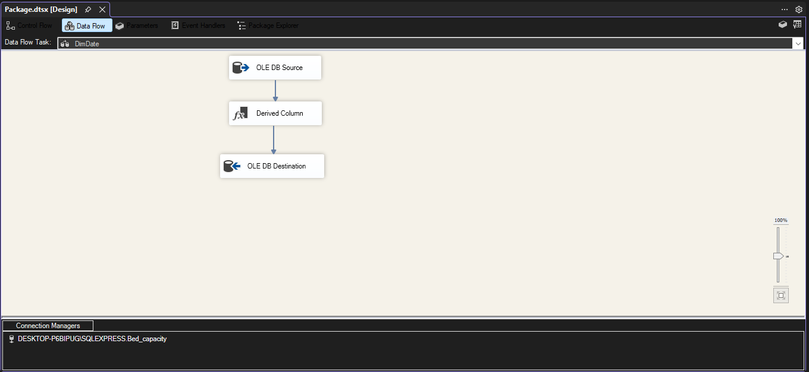
</p>

#### Dimension Load 2

<p align="center">
  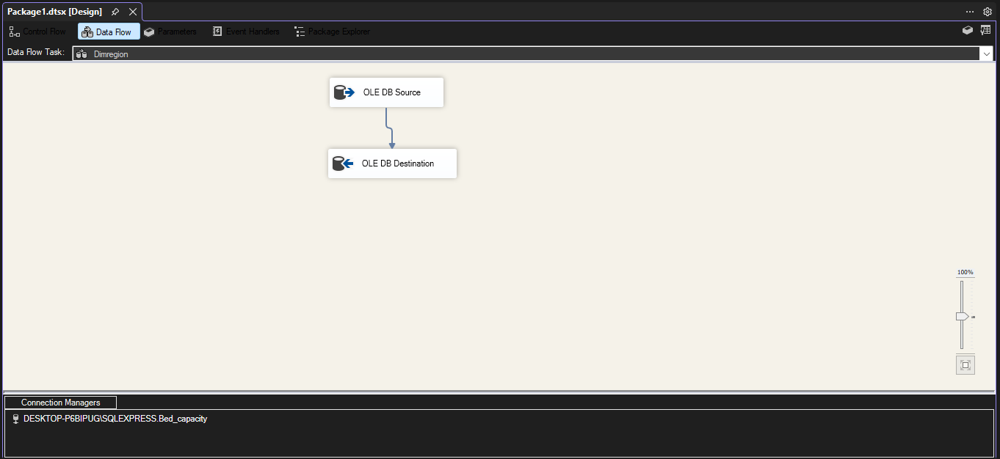
</p>

#### Dimension Load 3

<p align="center">
  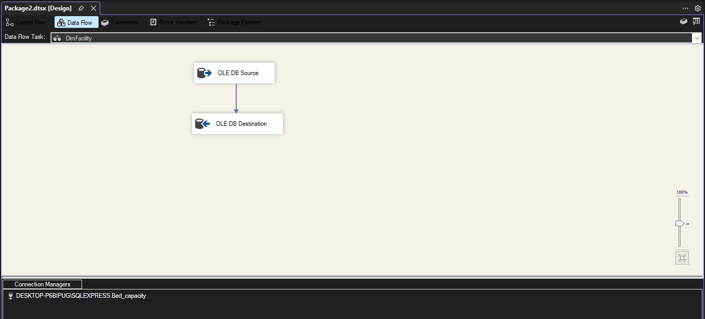
</p>

#### Fact Table Load

<p align="center">
  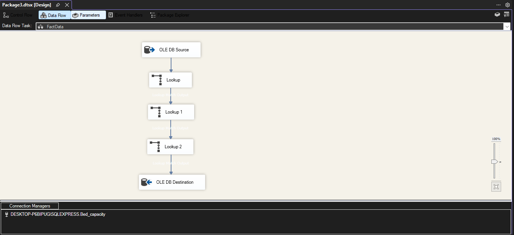
</p>

### Transformations Used

* Data Conversion
* Derived Columns
* Lookup Transformations
* OLE DB Source
* OLE DB Destination

### Benefits

* Data Quality Improvement
* Referential Integrity Maintenance
* Data Standardization
* Efficient Warehouse Loading

---

## SSRS Reports

### Report 1 – Regional Hospital Bed Capacity Summary

Provides regional comparisons of:

* Total Acute Beds
* Available Acute Beds
* Total ICU Beds
* Available ICU Beds

<p align="center">
  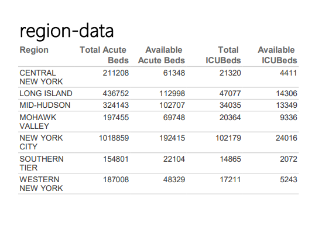
</p>

---

### Report 2 – Daily Hospital Bed Occupancy Trends

Tracks:

* Acute Bed Occupancy
* ICU Occupancy
* Total Occupancy

<p align="center">
  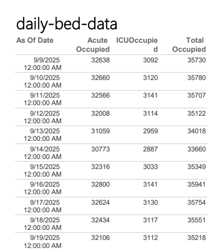
</p>

---

## Tableau Visualizations

### Visualization 1 – Region vs Bed Counts

Type:

* Clustered Bar Chart

Purpose:

* Compare regional bed availability and capacity.

<p align="center">
  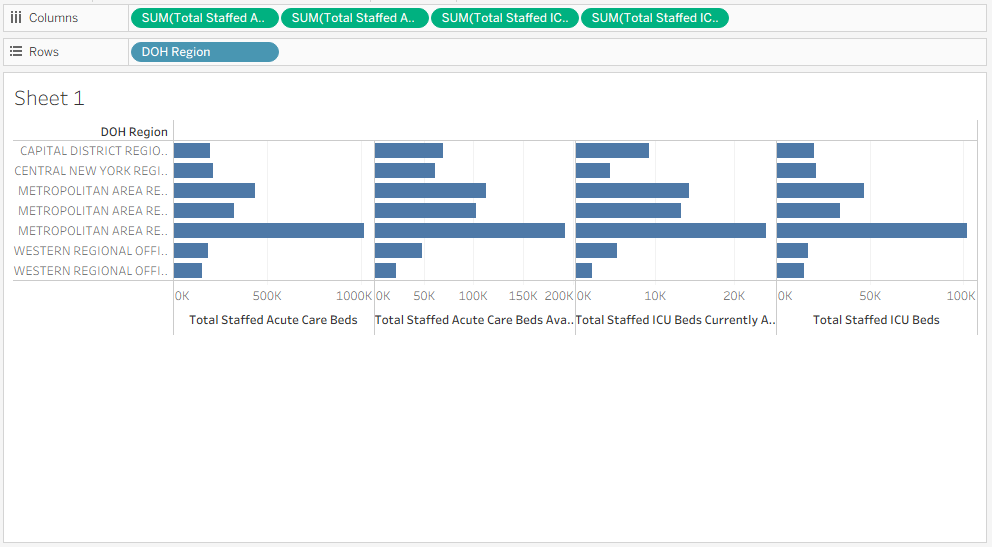
</p>

---

### Visualization 2 – Daily Occupancy Trends

Type:

* Line Chart

Purpose:

* Monitor hospital occupancy over time.

<p align="center">
  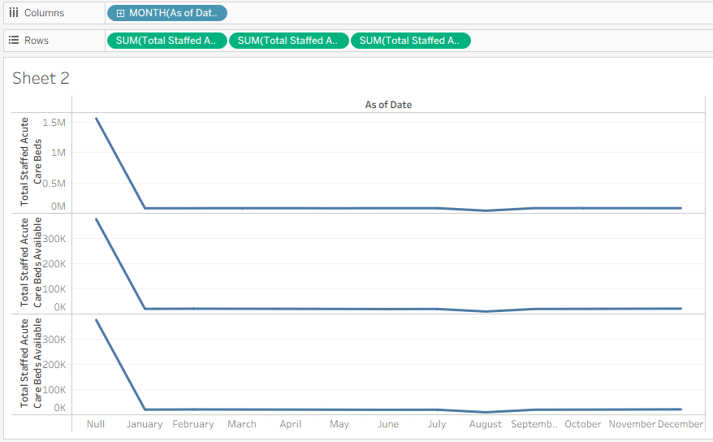
</p>

---

## Tableau Dashboard

The dashboard combines:

### Top Section

* Regional Bed Capacity Analysis

### Bottom Section

* Daily Occupancy Trend Analysis

<p align="center">
  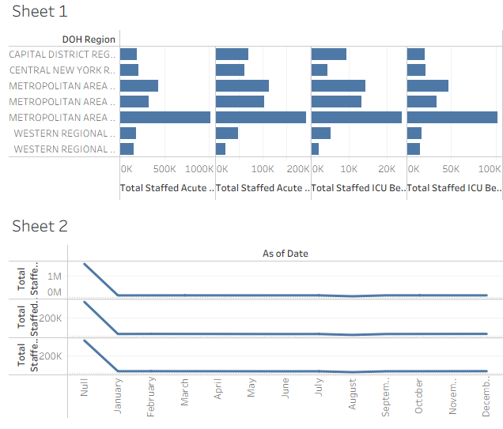
</p>

---

## Neo4j Graph Database Implementation

### Graph Nodes

* Facility
* County
* Region

### Relationships

```text
(Facility)-[:LOCATED_IN]->(County)

(County)-[:PART_OF]->(Region)
```


### Benefits of Graph Modeling

* Relationship Analysis
* Healthcare Network Exploration
* Region-to-Facility Traversal
* Simplified Multi-Level Queries

---

## SQL vs Neo4j Comparison

| Feature                | SQL Server | Neo4j     |
| ---------------------- | ---------- | --------- |
| Aggregation Queries    | Excellent  | Good      |
| Reporting              | Excellent  | Limited   |
| Relationship Traversal | Moderate   | Excellent |
| Hierarchical Queries   | Complex    | Simple    |
| Schema Flexibility     | Fixed      | Flexible  |

---

## Repository Structure

```text
SSIS_Fullcode
│
├── README.md
├── LICENSE
├── New_York_State_Statewide_Hospital_Bed_Data.xls
│
├── CQL-SQL/
│   ├── cql-1.png
│   ├── cql-2.png
│   ├── sql-1.png
│   └── sql-2.png
│
├── Images/
│   ├── Architecture-diagram.png
│   ├── Banner.png
│   ├── DF1.png
│   ├── DF2.png
│   ├── DF3.png
│   ├── DF4.png
│   ├── report1.png
│   ├── report2.png
│   └── tab3.png
│
├── Report/
│   └── report.docx
│
├── SSIS file/
│   └── BedcapacityWork/
│
├── SSRS file/
│   ├── SSRS-report-1/
│   ├── SSRS-report-2/
│   ├── ssis-ss0.png
│   ├── ssis-ss1.png
│   ├── ssis-ss2.png
│   └── ssis-ss3.png
│
├── SSRS report - PDF,PNG/
│   ├── report-1.pdf
│   ├── report1.png
│   ├── report-2.pdf
│   └── report2.png
│
└── tableau/
    ├── dashboard.png
    ├── tableau-visual.twb
    ├── tableau-visual-dashboard.twbx
    ├── visual-1.png
    └── visual-2.png
```

---

## Technologies Used

* SQL Server
* SSIS
* SSRS
* Tableau
* Neo4j
* Cypher Query Language (CQL)

---

## Applications

* Healthcare Capacity Planning
* Emergency Preparedness
* Resource Allocation
* Public Health Analytics
* Hospital Performance Monitoring

---

## Future Enhancements

* Real-time Data Integration
* Power BI Dashboard Integration
* Predictive Occupancy Forecasting
* Machine Learning-Based Capacity Prediction
* Cloud-Based BI Deployment

---

## Author

Michelle Obi

MSc Data Analytics / Business Intelligence Project

Hospital Resource Availability Analysis using SSIS, SSRS, Tableau, and Neo4j

---

## License

This project is licensed under the MIT License.

